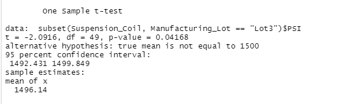

# MechaCar_Statistical_Analysis
## Overview
Statistics is a cornerstone of data analytics. In this project, we analyze different summary statistics and regression models for the company AutoRUs using R program.
### Purpose
AutosRUs needs to complete retrospective analysis, analytical verification, and validation of automatic specifications, and study designs of future product testing. We use data analytics using R to complete thorough and clear statistical testing for the company.
## Linear Regression to Predict MPG
In this analysis, we performed a multiple linear regression model on our dataset for MechaCars' mpg (miles-per-gallon). When we performed a summary, are results are shown below:  
  
 
**Which variables/coefficients provided a non-random amount of variance to the mpg values in the dataset?**  
According to our analysis, the Intercept, vehicle length, and ground clearance are unlikely to create random variance to the mpg values.  
 
**Is the slope of the linear model considered to be zero? Why or why not?**  
We can determine that our linear model would not be considered zero. There are variables that are not by random chance. Our r square is .72 and shows that 70% of our variability is explained by our variables and our p value of 5.35e-11 is well below our .05 significance level. This shows there is some correlation, and our slope is not zero.  
 
**Does this linear model predict mpg of MechaCar prototypes effectively? Why or why not?**   
We can say this linear model can efficiently predict mpg because our r squared is .72. This is a high significant level; we can look at some of our independent variables and know that they will effectively predict mpg of MechaCar prototypes.  
 
## Summary Statistics on Suspension Coils
**The design specifications for the MechaCar suspension coils dictate that the variance of the suspension coils must not exceed 100 pounds per square inch. Does the current manufacturing data meet this design specification for all manufacturing lots in total and each lot individually? Why or why not?**  
We completed statistical summaries on our Manufacturing lots and they are listed below:  
  
 
  
 
Our variance for all the manufacturing lots in total meets design specifications with a variance no larger than 62.3. Our variance for lot 1 and lot 2 meet specifications with variance of .98 and 7.4 respectively. Lot 3 needs more modifications with a variance of 170.3 which is far over the design specifications.
## T-Tests on Suspension Coils
We performed t-tests on the PSI of suspension coils to determine if there is statistical difference between the population mean and the sample mean. The results for our T-test are listed below:  
 
***T-test on total PSI***
      
 
***T-test on Lot 1 PSI***
      
 
***T-test on Lot 2 PSI***
      
 
***T-test on Lot 3 PSI***
    
 
For total suspension coils we show the true mean of 1498.78 is not equal to 1500. However, our p-value is .06 and is above the level of significance .05, and we are unable to reject the null hypothesis. Our t-test shows that the sample and the population are statistically similar. We also complete t-testing for each manufacturing lot. For suspension coils PSI for lot 1, the true mean of 1500 and our p-value is 1, which is above .05, so there is some statistical similarity. The same can be said of Lot 2, which has a mean of 1500.2 and a p value of .6 which is above .05, so this shows statistical similarity. Lot 3 shows a mean of 1496.14 which is not equal to 1500. Our p-value is .04168 which is below .05. We can reject our null hypothesis; the population and sample means are not statistically similar. There should be modification to the sample for Lot 3 to get a more representative sample.

## Study Design: MechaCar vs Competition
Write a short description of a statistical study that can quantify how the MechaCar performs against the competition. In your study design, think critically about what metrics would be of interest to a consumer: for a few examples, cost, city or highway fuel efficiency, horse power, maintenance cost, or safety rating.
I would like to run more analytics and understand mpg based on vehicle weight and spoiler angle.  I would test this using Anova test. My null Hypothesis is that means for all groups will be equal. I believe these metrics with this test will show if there is statistical difference in mpg based on weight and spoiler angle. I will need to pull the data table for MechaCar_mpg and take subsets for the columns mpg, vehicle_weight and spoiler_angle. Once I run my ANOVA test I will be able to compare the Pr(>F) column for each variable to our significance level of .05. I will be able to compare the two to see if each metric has statistical significance on mpg and this can tell me more about the efficiency of the MechaCar prototypes.
